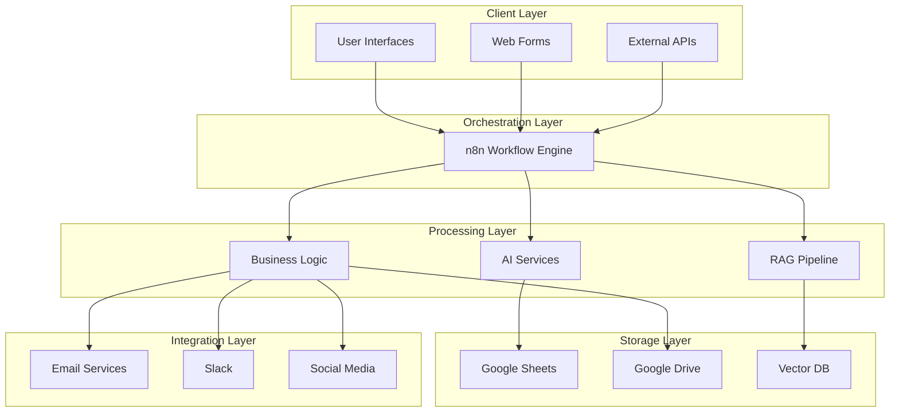

# Architecture Overview

## System Architecture

This document describes the overall architecture of the AI Automation Portfolio.

## High-Level Architecture



## Workflow Patterns

### 1. Document Processing Pattern
Used by: Invoice Processing

```
Trigger -> Validate -> Extract -> AI -> Validate -> Store -> Notify
```

### 2. Voice AI Pattern
Used by: Lead Qualification

```
Trigger -> Fetch Data -> Format -> Validate -> Call AI -> Webhook -> Update
```

### 3. RAG Pattern
Used by: Document Agent

```
Upload -> Embed -> Store
Query -> Embed -> Search -> LLM -> Answer
```

### 4. Notification Pattern
Used by: Department News, Lead Capture

```
Trigger -> Fetch -> Process -> AI -> Distribute
```

## Design Principles

1. **Modularity** - Each workflow is independent
2. **Reliability** - Comprehensive error handling
3. **Security** - Environment variables, OAuth2
4. **Scalability** - Stateless workflows
5. **Maintainability** - Clear documentation

## Cross-Workflow Concerns

### Authentication
- Google: OAuth2
- OpenAI: API Key
- Pinecone: API Key
- Vapi: Bearer Token
- Social: OAuth2

### Data Storage
- Google Sheets: Structured data
- Pinecone: Vector embeddings
- Google Drive: File storage

### Notification
- Gmail: Email notifications
- Slack: Team alerts
- Webhooks: External integrations
