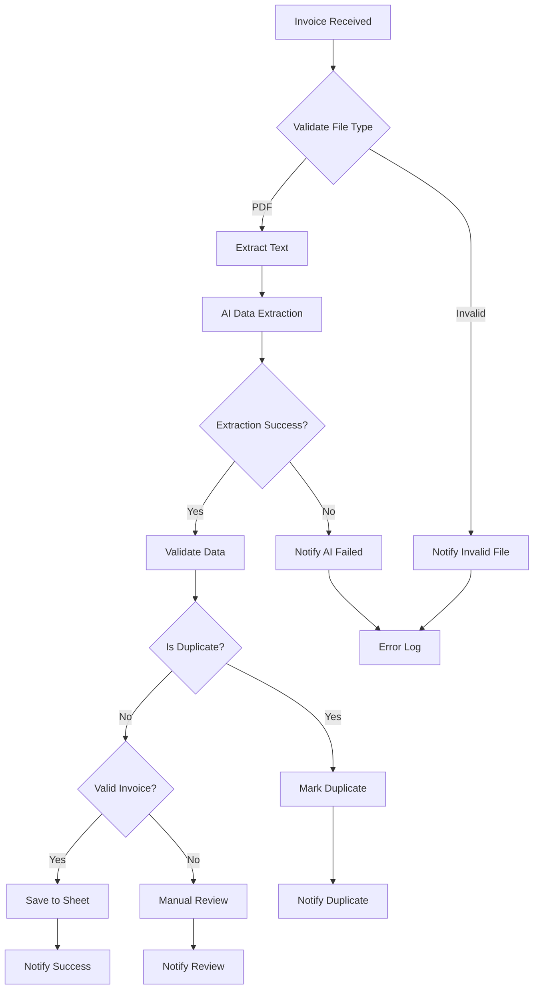

# AI Invoice Processing

Automated invoice data extraction and validation using Google Gemini AI.

---

## 1. Business Problem

Manual invoice processing is time-consuming and error-prone:

- Finance teams spend hours manually entering invoice data
- Human errors in data entry lead to payment delays
- Duplicate invoices may be processed multiple times
- Invalid or corrupted files cause workflow interruptions
- No standardized validation leads to inconsistent records

---

## 2. Solution

This workflow automates the entire invoice processing pipeline:

- Accepts invoices from Google Drive folder or web form
- Extracts structured data using Google Gemini AI
- Validates data completeness and confidence scores
- Detects duplicate invoices automatically
- Stores results in Google Sheets
- Sends email notifications for success, review, or errors

---

## 3. Workflow Architecture

---

## 4. Workflow Steps

1. **Trigger** - Monitors Google Drive folder or accepts web form submission
2. **File Validation** - Verifies file is PDF format
3. **Text Extraction** - Extracts text content from PDF
4. **AI Extraction** - Uses Gemini to extract structured invoice data
5. **Data Validation** - Checks for required fields and confidence score
6. **Duplicate Detection** - Queries Google Sheets to detect existing invoices
7. **Data Storage** - Saves validated data to invoice tracking sheet
8. **Notifications** - Sends appropriate email based on outcome

---

## 5. AI Components

- **Google Gemini** - Powers the invoice data extraction
- **Information Extractor Node** - Structured output with defined schema
- **Confidence Scoring** - AI provides confidence level for each extraction

### Extraction Fields

| Field | Required | Description |
|-------|----------|-------------|
| Invoice Number | Yes | Unique invoice identifier |
| Vendor Name | Yes | Name of the vendor/supplier |
| Invoice Date | Yes | Date on the invoice |
| Total Amount | Yes | Total amount due |
| Tax Amount | Yes | Tax portion |
| Currency | Yes | Currency code (USD, INR, etc.) |
| List of Items | No | Line items on invoice |
| Quantity | No | Total quantity |
| Confidence Score | Auto | AI confidence in extraction |

---

## 6. Integrations

| Service | Purpose |
|---------|---------|
| Google Drive | Invoice file storage and triggers |
| Google Sheets | Invoice data storage |
| Gmail | Email notifications |
| Google Gemini | AI data extraction |

---

## 7. Input

- **Google Drive**: PDF files uploaded to monitored folder
- **Web Form**: PDF file uploaded via form submission

---

## 8. Output

- **Google Sheets**: New row with invoice data and status
- **Email**: Notification to finance team

---

## 9. Error Handling

| Error Type | Handling |
|------------|----------|
| Invalid file type | Email notification with error details |
| Extraction failure | Email notification, workflow continues |
| Missing required fields | Marked for manual review |
| Duplicate invoice | Skipped, notification sent |
| Storage failure | Error notification with details |

---

## 10. Human-in-the-Loop

Manual review is required when:

- AI confidence score is below 0.7
- Required fields are missing
- Invoice is flagged as potential duplicate
- Extraction fails completely

---

## 11. Security

- **OAuth2** - All Google integrations use OAuth2
- **Webhook Security** - Unique webhook IDs per workflow
- **Credential Management** - Credentials stored in n8n, not in workflow
- **Least Privilege** - Minimal permissions required

---

## 12. Testing

| Test Case | Expected Result |
|-----------|----------------|
| Valid PDF invoice | Processed successfully |
| Missing invoice number | Flagged for manual review |
| Duplicate invoice | Skipped with notification |
| Corrupt PDF | Error notification sent |
| Invalid AI response | Validation failure, manual review |
| Drive API failure | Error notification sent |
| Non-PDF file | Rejected with notification |

---

## 13. Business Value

- **Time Savings**: Eliminates manual data entry
- **Accuracy**: AI-powered extraction reduces human errors
- **Consistency**: Standardized processing pipeline
- **Auditability**: Complete record of all invoices
- **Speed**: Near-instant processing vs. hours manual

---

## 14. Future Improvements

- [ ] Add OCR for scanned documents
- [ ] Implement invoice approval workflow
- [ ] Add vendor validation against master list
- [ ] Create payment scheduling integration
- [ ] Add expense categorization
- [ ] Implement multi-currency conversion
