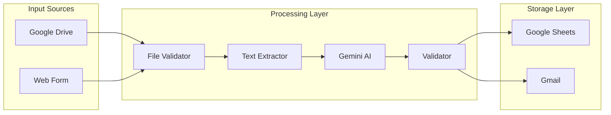
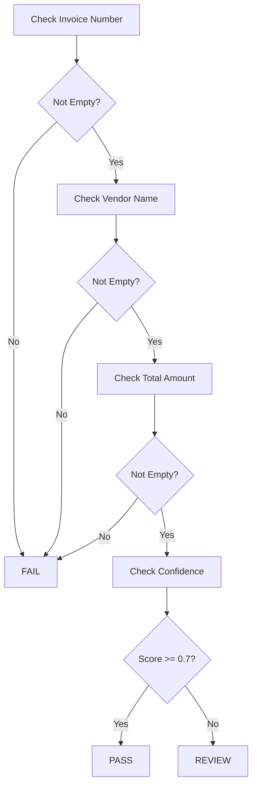
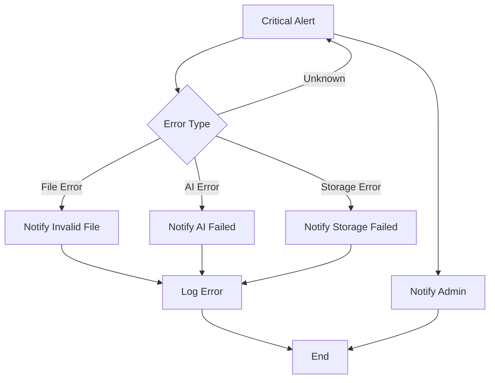

# AI Invoice Processing - Architecture

## System Overview

This workflow implements a production-grade invoice processing system using n8n and Google Gemini AI.

---

## Component Architecture



---

## Data Flow

### 1. Trigger Phase

**Google Drive Trigger**:
- Monitors specific folder for new files
- Triggers on file creation event
- Downloads file for processing

**Form Trigger**:
- Accepts file uploads via web form
- Accessible via shareable URL

### 2. Validation Phase

```javascript
// File type validation
if (mimeType.contains("pdf")) {
  // Continue to extraction
} else {
  // Send invalid file notification
}
```

### 3. Extraction Phase

Uses n8n's Information Extractor node with structured output:

```json
{
  "Invoice Number": "string",
  "Vendor Name": "string",
  "Invoice Date": "date",
  "Total Amount": "number",
  "Tax Amount": "number",
  "Currency": "string",
  "Confidence score": "number"
}
```

### 4. Validation Phase



### 5. Duplicate Detection

Queries Google Sheets to check if invoice number already exists:

```sql
SELECT * FROM Invoice_Sheet 
WHERE [Invoice Number] = '{extracted_number}'
```

---

## Error Handling Strategy



---

## Data Schema

### Input Document

PDF invoice with fields:
- Invoice Number
- Vendor Name
- Invoice Date
- Due Date (optional)
- Line Items
- Subtotal
- Tax
- Total Amount
- Currency

### Output Record

| Field | Type | Description |
|-------|------|-------------|
| Invoice Number | String | Unique identifier |
| Vendor Name | String | Supplier name |
| Invoice Date | Date | Invoice date |
| Total Amount | Number | Total payable |
| Tax Amount | Number | Tax portion |
| Currency | String | Currency code |
| Status | String | Processed/Review/Duplicate |
| List of Items | String | Comma-separated items |
| Quantity | Number | Total units |
| Confidence Score | Number | AI confidence 0-1 |
| Processing timestamp | DateTime | When processed |

---

## Security Considerations

1. **Credential Isolation**: All Google credentials stored in n8n vault
2. **File Access**: Only monitors designated folder
3. **Data Retention**: Historical data retained per policy
4. **Email Security**: Notifications sent to authorized addresses only

---

## Performance Considerations

- **Concurrent Processing**: Can handle multiple invoices
- **API Rate Limits**: Built-in delays for API calls
- **Timeout Handling**: Configurable timeout for AI calls
- **Retry Logic**: Automatic retry for transient failures
