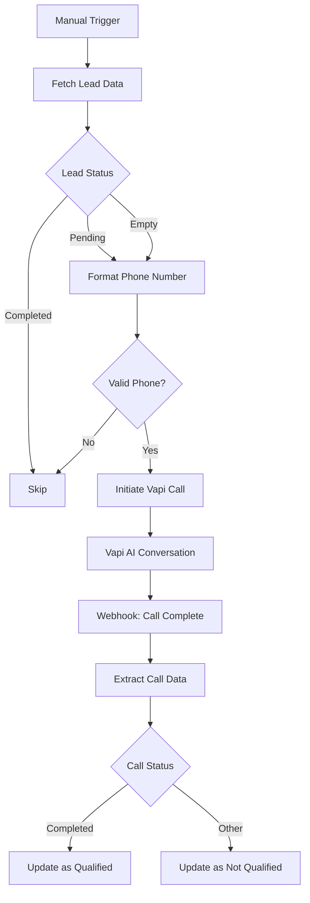

# AI Lead Qualification

Voice-based AI lead qualification using Vapi AI and Google Gemini.

---

## 1. Business Problem

Traditional lead qualification faces challenges:

- Sales teams spend hours on initial qualification calls
- High-value leads may be missed due to slow follow-up
- Inconsistent qualification criteria across team members
- Manual data entry of call outcomes
- Limited ability to scale qualification efforts

---

## 2. Solution

This workflow automates lead qualification through:

- AI-powered voice calls using Vapi AI
- Automated qualification conversations
- Phone number formatting for global standards
- Real-time conversation analysis
- Automatic lead status updates in Google Sheets

---

## 3. Workflow Architecture

---

## 4. Workflow Steps

1. **Manual Trigger** - User initiates the workflow
2. **Fetch Lead Data** - Pulls lead information from Google Sheets
3. **Status Check** - Switch routes based on lead status (Pending/Empty/Completed)
4. **Phone Formatting** - Normalizes phone number to international format
5. **Phone Validation** - Checks if phone number exists
6. **Vapi Call** - Initiates AI voice call
7. **Webhook Listener** - Receives call completion notification
8. **Data Extraction** - Extracts summary, transcript, call status
9. **Sheet Update** - Updates lead record with outcome

---

## 5. AI Components

- **Vapi AI** - Voice AI platform for natural conversations
- **Google Gemini** - May be used for conversation analysis
- **AI Assistant** - Custom-trained qualification assistant

### Qualification Criteria

The AI evaluates leads based on:

- Need for the product/service
- Budget availability
- Timeline for decision
- Authority to purchase
- Company size and fit

---

## 6. Integrations

| Service | Purpose |
|---------|---------|
| Google Sheets | Lead database |
| Vapi AI | Voice calling |
| Webhook | Call completion callback |

---

## 7. Input

- Google Sheets row with lead data (Name, Phone, Email, Company)
- Manual trigger execution

---

## 8. Output

- Updated Google Sheets row with:
  - Outcome (Qualified/Not Qualified)
  - Summary
  - Transcript
  - Call ID
  - Status (Completed/Pending)

---

## 9. Error Handling

| Scenario | Handling |
|----------|----------|
| No phone number | Skip lead, continue processing |
| Failed call | Webhook will not fire, lead remains Pending |
| No call status update | Lead status remains as is |

---

## 10. Human-in-the-Loop

Sales team reviews:

- Qualified leads for follow-up
- Call transcripts for context
- Not qualified leads for reassessment

---

## 11. Security

- **API Keys** - Vapi credentials stored securely
- **Phone Numbers** - Customer phone data handled per privacy regulations
- **Webhook Security** - Vapi webhooks use unique IDs
- **OAuth2** - Google Sheets authentication

---

## 12. Testing

| Test Case | Expected Result |
|-----------|----------------|
| Valid phone, Pending status | Call initiated |
| Valid phone, Completed status | Skip lead |
| Empty phone number | Skip lead |
| No email in record | Call still proceeds |
| International phone number | Formatted correctly |

---

## 13. Business Value

- **24/7 Qualification**: Calls can happen at any time
- **Consistent Messaging**: AI uses approved qualification script
- **Cost Reduction**: Reduces sales team manual calling time
- **Faster Follow-up**: Qualified leads identified immediately
- **Scalable**: Can handle many calls in parallel

---

## 14. Future Improvements

- [ ] Add lead scoring model
- [ ] Integrate with CRM (HubSpot, Salesforce)
- [ ] Add call recording and analytics
- [ ] Multi-language support
- [ ] Smart retry for failed calls
- [ ] A/B testing for different scripts
- [ ] Integration with calendar for meeting booking
