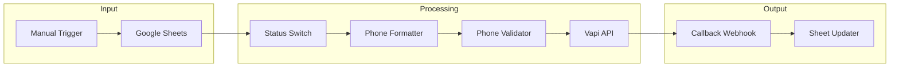
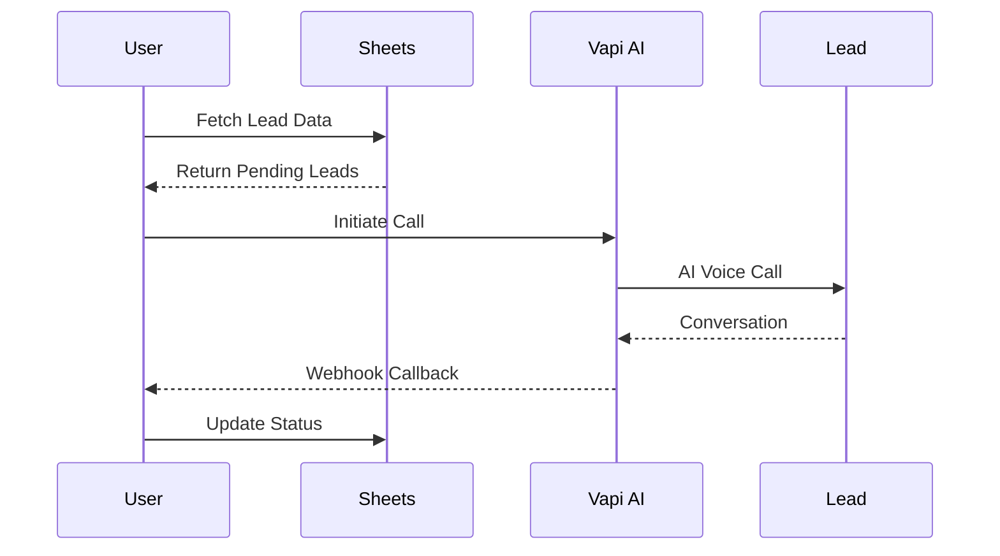

# AI Lead Qualification - Architecture

## System Overview

This workflow combines manual trigger, Google Sheets data, and Vapi AI to automate sales lead qualification through voice calls.

---

## Component Architecture



---

## Call Flow



---

## Status Routing

The Switch node handles three states:

| Status | Action |
|--------|--------|
| Pending | Process lead |
| Empty | Process lead |
| Completed | Skip lead |

---

## Phone Number Normalization

```javascript
// Indian phone number formatting
'+91' + phoneNumber
  .toString()
  .replace(/\D/g, '')      // Remove non-digits
  .replace(/^1/, '')       // Remove leading 1
```

---

## Vapi Integration

### Request Format

```json
{
  "assistantId": "your-assistant-id",
  "phoneNumberId": "your-phone-id",
  "customer": {
    "number": "+91XXXXXXXXXX",
    "name": "Lead Name",
    "email": "lead@example.com"
  }
}
```

### Webhook Response

```json
{
  "body": {
    "message": {
      "artifact": {
        "variables": {
          "call": {
            "status": "completed",
            "type": "outbound"
          }
        }
      },
      "analysis": {
        "summary": "Call summary"
      },
      "assistant": {
        "analysisPlan": {
          "summaryPlan": {
            "messages": [{"content": "Summary"}, {"content": "Transcript"}]
          }
        }
      }
    }
  },
  "headers": {
    "x-call-id": "call-id-here"
  }
}
```

---

## Configuration

### Required Credentials

- Google Sheets OAuth2 API
- Vapi API Token (Bearer)
- Vapi Assistant ID
- Vapi Phone Number ID

### Required Environment Variables

```env
VAPI_ACCESS_TOKEN=
VAPI_ASSISTANT_ID=
VAPI_PHONE_NUMBER_ID=
SHEET_LEAD_DATA_ID=
```

---

## Security Considerations

1. **Phone Privacy**: Customer phone numbers handled per GDPR/local regulations
2. **API Key Protection**: Vapi token stored as environment variable
3. **Webhook Authentication**: Vapi webhooks should use shared secret
4. **Data Retention**: Call recordings retained per policy

---

## Performance Considerations

- **Concurrent Calls**: Vapi supports parallel calls
- **Rate Limits**: Vapi API has per-minute limits
- **Timeout**: Webhook timeout should be configured
- **Retry Logic**: Failed calls should not be retried immediately
