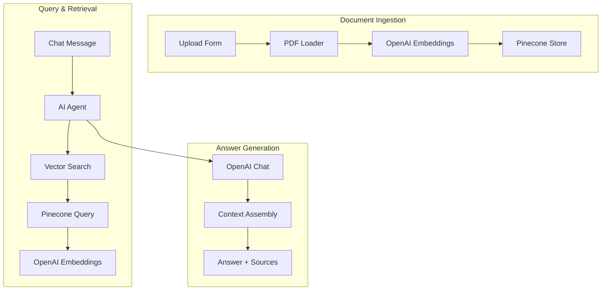

# RAG Document Agent

Enterprise document intelligence with Retrieval-Augmented Generation (RAG) using OpenAI and Pinecone.

---

## 1. Business Problem

Organizations struggle with:

- Finding relevant information in large document repositories
- Getting accurate answers from internal documentation
- Avoiding AI hallucinations in critical business decisions
- Providing source attribution for AI-generated answers
- Maintaining conversation context across questions

---

## 2. Solution

This workflow provides:

- Document upload and vectorization pipeline
- Semantic search using embeddings
- Retrieval-augmented generation with sources
- Conversational memory for context
- Multi-model AI architecture (embedding + chat)

---

## 3. Workflow Architecture

---

## 4. Workflow Steps

### Ingestion Pipeline

1. **Document Upload** - User uploads PDF via form
2. **PDF Parsing** - Extract text content from PDF
3. **Chunking** - Split into manageable chunks
4. **Embedding Generation** - Convert to vectors using OpenAI
5. **Storage** - Save to Pinecone vector database

### Query Pipeline

1. **User Question** - User sends message via chat
2. **Query Embedding** - Convert question to vector
3. **Similarity Search** - Find relevant chunks in Pinecone
4. **Context Assembly** - Combine retrieved chunks
5. **LLM Generation** - Generate answer with context
6. **Memory Update** - Maintain conversation history

---

## 5. AI Components

- **OpenAI Embeddings** - Text vectorization (text-embedding-3-small)
- **OpenAI Chat** - Answer generation (gpt-4.1-mini)
- **AI Agent** - Orchestrates tool use and reasoning
- **Vector Store Tool** - Retrieves relevant documents
- **Memory Buffer** - Maintains conversation context

### Models Used

| Purpose | Model | Rationale |
|---------|-------|-----------|
| Embeddings | text-embedding-3-small | Cost-effective, high quality |
| Chat | gpt-4.1-mini | Balance of speed and accuracy |
| Agent | gpt-4.1-mini | Tool use capability |

---

## 6. Integrations

| Service | Purpose |
|---------|---------|
| OpenAI | Embeddings and chat completions |
| Pinecone | Vector database |
| n8n Chat Trigger | User interface |

---

## 7. Input

- **Ingestion**: PDF documents
- **Query**: Natural language questions via chat

---

## 8. Output

- **Ingestion**: Vector embeddings stored in Pinecone
- **Query**: AI-generated answers with source attribution

---

## 9. Error Handling

| Scenario | Handling |
|----------|----------|
| Empty retrieval | Agent indicates information not found |
| API timeout | n8n retry logic |
| Invalid PDF | PDF loader returns error |
| Storage failure | n8n error trigger |

---

## 10. Human-in-the-Loop

- Users can review source documents
- Conversation history allows for clarification
- Low-confidence answers prompt for more context

---

## 11. Security

- **API Keys** - OpenAI and Pinecone credentials stored in n8n
- **Document Privacy** - Documents stored in private vector index
- **Access Control** - Chat interface can be made public or private
- **Data Isolation** - Each deployment uses isolated index

---

## 12. Testing

| Test Case | Expected Result |
|-----------|----------------|
| Upload valid PDF | Vectors stored in Pinecone |
| Ask about document content | Accurate answer with context |
| Ask unrelated question | Agent indicates not found |
| Upload empty PDF | Error handling |
| Chat with context | Maintains conversation history |
| Multiple documents | Cross-document retrieval works |

---

## 13. Business Value

- **Knowledge Access**: Instant access to company knowledge
- **Time Savings**: No more searching through documents
- **Accuracy**: Grounded in actual document content
- **Consistency**: Same answers regardless of who asks
- **Scalability**: Can handle growing document collections

---

## 14. Future Improvements

- [ ] Add source URL/document name in answers
- [ ] Implement relevance score thresholds
- [ ] Add document categorization
- [ ] Multi-language support
- [ ] User feedback mechanism for answer quality
- [ ] Automatic document re-indexing on updates
- [ ] Support for more file types (DOCX, TXT, MD)
- [ ] Implement citation formatting
- [ ] Add hallucination detection
- [ ] Support for structured queries
