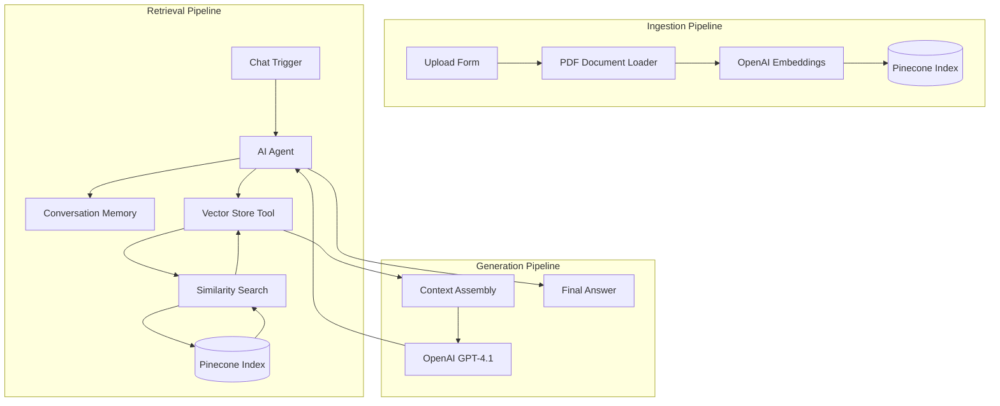
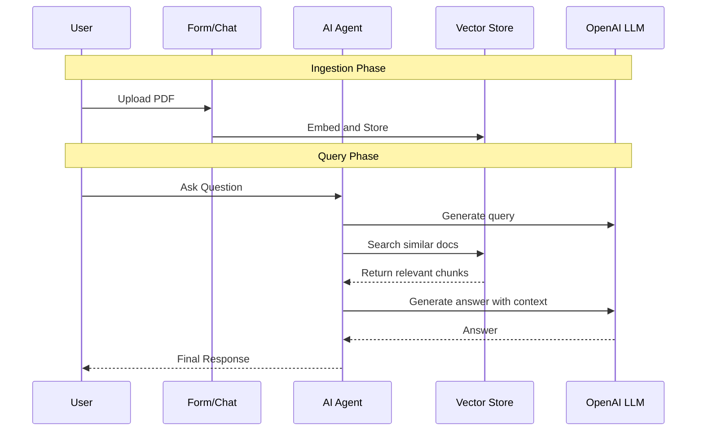
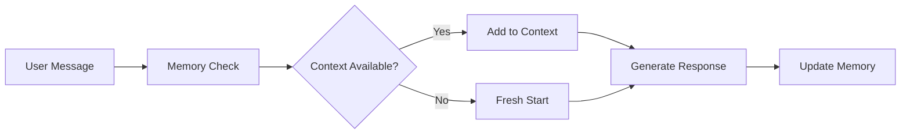

# RAG Document Agent - Architecture

## System Overview

A production RAG (Retrieval-Augmented Generation) system using n8n, OpenAI, and Pinecone for enterprise document intelligence.

---

## High-Level Architecture



---

## Data Flow



---

## Component Details

### 1. PDF Document Loader

- **Type**: n8n LangChain Document Loader
- **Function**: Parses PDF binary into text chunks
- **Configuration**: Default PDF loader, no special options

### 2. Embedding Model

- **Model**: text-embedding-3-small
- **Dimensions**: 1536 (default)
- **Batch Size**: 500 vectors per batch
- **Use Case**: Document and query embedding

### 3. Vector Store

- **Service**: Pinecone
- **Index Name**: n8n
- **Mode**: Insert (ingestion), Search (retrieval)
- **Distance Metric**: Cosine similarity

### 4. AI Agent

- **Type**: LangChain Agent
- **Capabilities**: Tool use, reasoning, conversation
- **Memory**: Buffer window memory for context
- **System Prompt**: Configured for helpful Q&A

### 5. Chat Model

- **Model**: gpt-4.1-mini
- **Context Window**: 128K tokens
- **Use Case**: Final answer generation
- **Tool**: Can call vector store for retrieval

---

## Index Schema

### Pinecone Index

```
Index Name: n8n
Dimensions: 1536
Metric: cosine
Pod Type: starter (can scale to production)

Vector Metadata:
- text: Original text chunk
- source: Document name
- page: Page number
- upload_date: When added
```

---

## Memory Management



---

## Configuration

### Required Environment Variables

```env
OPENAI_API_KEY=
PINECONE_API_KEY=
PINECONE_INDEX_NAME=n8n
```

### Required Credentials

- OpenAI API (for both embeddings and chat)
- Pinecone API

---

## Security Considerations

1. **API Key Storage**: All keys in n8n credentials vault
2. **Index Isolation**: Dedicated index for this application
3. **Access Control**: Chat endpoint can be public or restricted
4. **Data Encryption**: Pinecone encrypts data at rest
5. **Audit Logging**: n8n execution logs available

---

## Performance Considerations

- **Embedding Latency**: ~200-500ms per chunk
- **Search Latency**: ~50-100ms for top-k retrieval
- **LLM Latency**: ~1-3s for answer generation
- **Throughput**: Can process multiple queries in parallel
- **Index Limits**: Pinecone starter plan has vector limits

---

## Hallucination Prevention

Strategies implemented:

1. **Grounded Context**: Answers based on retrieved documents only
2. **Tool Restriction**: Agent instructed to use vector store
3. **Empty Retrieval Handling**: Explicit "not found" responses
4. **Memory Context**: Conversation aware for clarifications
- **Future**: Add confidence scores and source citations
