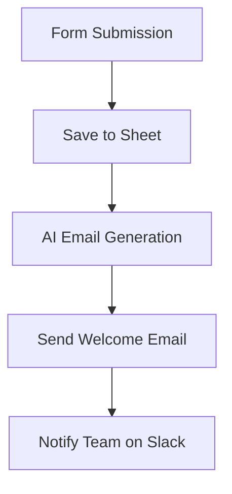

# AI Lead Capture

Automated lead capture, personalized email response, and team notification.

---

## 1. Business Problem

Manual lead handling has issues:

- Slow response times to new leads
- Generic, impersonal email responses
- Lost leads due to follow-up delays
- No team visibility into new inquiries
- Inconsistent messaging

---

## 2. Solution

This workflow provides:

- Instant form-based lead capture
- AI-generated personalized welcome emails
- Automatic data storage in Google Sheets
- Team notification via Slack
- Scalable response system

---

## 3. Workflow Architecture



---

## 4. Workflow Steps

1. **Form Trigger** - Captures user details (Name, Email, Message)
2. **Data Storage** - Saves lead data to Google Sheets
3. **AI Generation** - Google Gemini generates personalized welcome email
4. **Email Send** - Sends email to the lead
5. **Team Notification** - Alerts team via Slack

---

## 5. AI Components

- **Google Gemini** - Email content generation
- **AI Agent** - Orchestrates prompt and generation
- **Memory Buffer** - Maintains context

### Email Generation Prompt

```
Write a warm, professional welcome email to {Name} who just enquired about 
our service. Their message was: {Message}. Keep it under 100 words. 
Make sure the message should be in 2 paragraph.
```

---

## 6. Integrations

| Service | Purpose |
|---------|---------|
| Google Forms / n8n Form | Lead capture |
| Google Sheets | Data storage |
| Gmail | Email sending |
| Slack | Team notification |
| Google Gemini | AI content generation |

---

## 7. Input

User form fields:
- Full Name
- Email ID
- Message

---

## 8. Output

- Google Sheets: New row with lead data
- Email: Personalized welcome to lead
- Slack: Team notification

---

## 9. Error Handling

| Scenario | Handling |
|----------|----------|
| Email send failure | Slack notification of failure |
| Sheet storage failure | Workflow stops, alert sent |
| AI generation failure | Fallback to template email |

---

## 10. Human-in-the-Loop

Team members:

- Receive Slack notification for follow-up
- Review leads in Google Sheets
- Can customize responses if needed

---

## 11. Security

- **OAuth2** - Google integrations
- **Form Validation** - Email field validated
- **Rate Limiting** - n8n execution limits
- **Data Privacy** - Customer data stored securely

---

## 12. Testing

| Test Case | Expected Result |
|-----------|----------------|
| Valid form submission | All actions execute |
| Invalid email | Form validation prevents |
| Sheet write failure | Error notification |
| Email send failure | Error notification |
| Slack unavailable | Workflow continues |

---

## 13. Business Value

- **Speed**: Instant response to leads
- **Personalization**: AI-generated custom emails
- **Consistency**: Standardized follow-up
- **Visibility**: Team aware of new leads
- **Conversion**: Faster response = better conversion

---

## 14. Future Improvements

- [ ] Add lead scoring
- [ ] Integrate with CRM
- [ ] Add drip campaign sequences
- [ ] Multi-language support
- [ ] A/B test email templates
- [ ] Add calendar booking link
- [ ] Auto-categorize leads by intent
