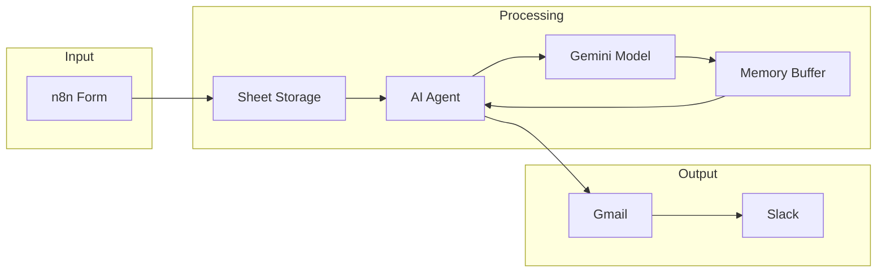
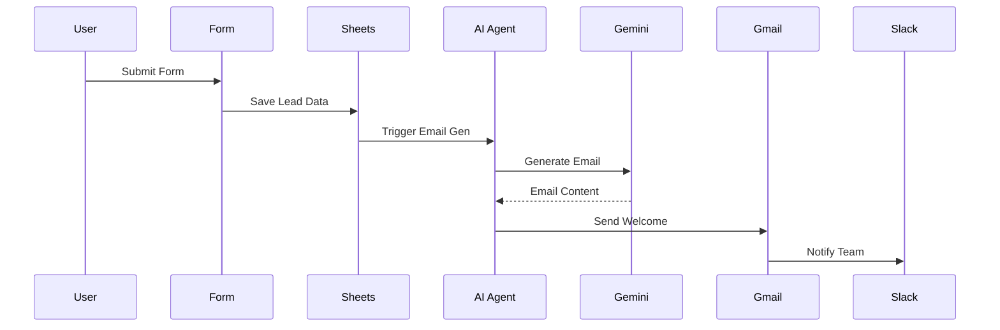

# AI Lead Capture - Architecture

## System Overview

Automated lead capture system with AI-generated personalized responses.

---

## Component Architecture



---

## Data Flow



---

## Configuration

### Required Environment Variables

```env
SHEET_LEAD_DATA_ID=
NOTIFICATION_EMAIL=
```

### Required Credentials

- Google Sheets OAuth2 API
- Gmail OAuth2 API
- Slack OAuth2 API
- Google Gemini (PaLM API)

---

## Security

1. **Email Validation**: Form validates email format
2. **OAuth2**: All Google/Slack use OAuth2
3. **Data Privacy**: Lead data stored securely
4. **Rate Limiting**: n8n execution limits apply
