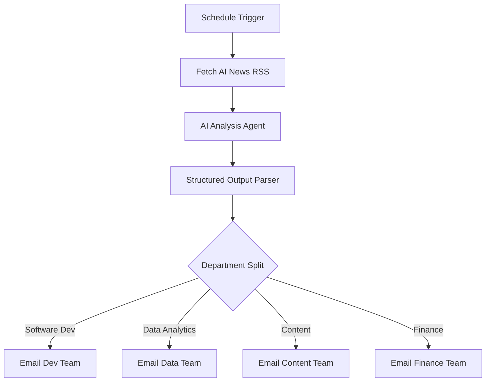

# Department Intelligence Agent

Automated AI news aggregation and departmental briefing system.

---

## 1. Business Problem

Teams struggle with:

- Keeping up with industry news and trends
- Manual research taking significant time
- Different teams needing different information
- Information overload from multiple sources
- Time zone differences in news consumption

---

## 2. Solution

This workflow provides:

- Scheduled automated execution (weekly)
- AI-powered news extraction and analysis
- Department-specific briefings
- Structured data presentation
- Email delivery to relevant teams

---

## 3. Workflow Architecture

---

## 4. Workflow Steps

1. **Schedule Trigger** - Runs weekly on Monday at 10 AM
2. **RSS Fetch** - Gets AI news from Google News RSS
3. **AI Analysis** - Gemini categorizes and summarizes news
4. **Structured Parsing** - Extracts structured output with categories
5. **Department Split** - Routes news to appropriate team
6. **Email Delivery** - Sends tailored briefings

---

## 5. AI Components

- **Google Gemini** - News categorization and summarization
- **Output Parser** - Structured extraction for departments
- **AI Agent** - Orchestrates the analysis

### Categories

- Software Development
- Data Analytics
- Content & Design
- Finance

---

## 6. Integrations

| Service | Purpose |
|---------|---------|
| n8n Schedule | Weekly trigger |
| Google News RSS | News source |
| Gmail | Email delivery |
| Google Gemini | AI analysis |

---

## 7. Input

- News RSS feed (Google News for AI topic)
- Scheduled execution

---

## 8. Output

- Department-specific email briefings
- Structured news summaries by category

---

## 9. Error Handling

| Scenario | Handling |
|----------|----------|
| RSS fetch failure | Workflow continues with empty data |
| AI failure | Email not sent |
| Invalid output | Email shows parsing error |

---

## 10. Future Improvements

- [ ] Multiple news sources
- [ ] Customizable categories per team
- [ ] Sentiment analysis
- [ ] Competitor monitoring
- [ ] Historical trend tracking
