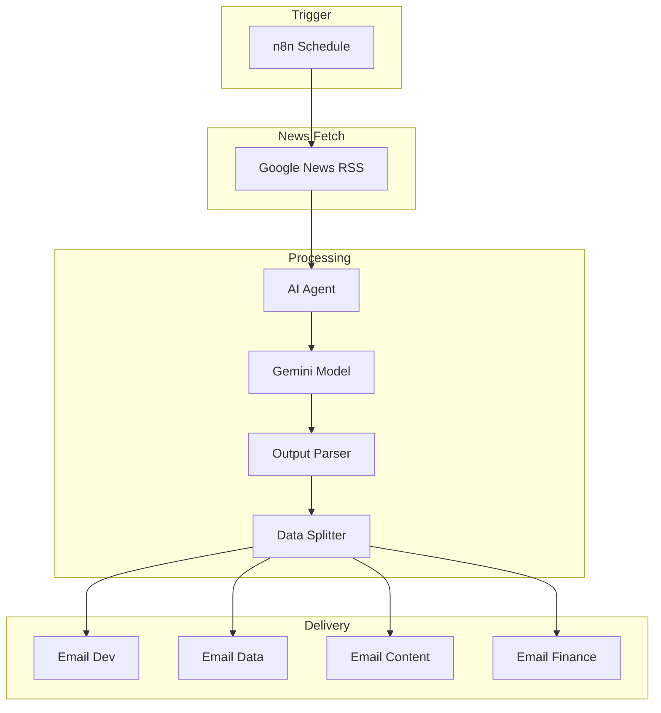

# Department Intelligence Agent - Architecture

## System Overview

Automated weekly news briefing system that aggregates, analyzes, and distributes industry news to different departments.

---

## Component Architecture



---

## News Categories

| Category | Department | Focus |
|----------|------------|-------|
| Software Development | Engineering | Tech news, tools, frameworks |
| Data Analytics | Analytics | BI, ML, data science |
| Content & Design | Creative | UX, content, design |
| Finance | Finance | Business, fintech, economics |

---

## Configuration

### Required Environment Variables

```env
NOTIFICATION_EMAIL=
```

### RSS Feed

```
https://news.google.com/rss/search?q=Artificial+Intelligence
```

---

## Output Schema

```json
{
  "Software Development": "...",
  "Data Analytics": "...",
  "Content & Design": "...",
  "Finance": "..."
}
```

---

## Security

1. **RSS Source**: Public news feed
2. **Email Delivery**: OAuth2 Gmail
3. **No Personal Data**: Only news content
