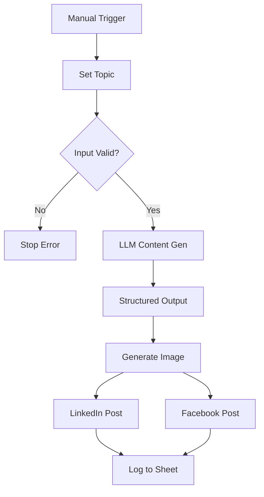

# AI Content Generation

Multi-platform social media content automation using AI.

---

## 1. Business Problem

Manual content creation is challenging:

- Time-consuming to create content for multiple platforms
- Inconsistent branding across platforms
- Difficult to maintain posting schedule
- Hard to generate engaging content consistently
- Image creation adds complexity

---

## 2. Solution

This workflow provides:

- AI-generated content for multiple platforms
- Platform-specific formatting (LinkedIn, Facebook)
- Automated image generation
- Scheduled or on-demand execution
- Content logging for analytics

---

## 3. Workflow Architecture

---

## 4. Workflow Steps

1. **Manual Trigger** - User provides topic, brief, and tone
2. **Input Validation** - Checks required fields
3. **Content Generation** - Gemini creates multi-platform content
4. **Structured Output** - Parses captions, hashtags, CTA, image prompt
5. **Image Generation** - Pollinations.ai creates featured image
6. **LinkedIn Publish** - Posts with image to LinkedIn
7. **Facebook Publish** - Posts to Facebook page
8. **Logging** - Records posts in Google Sheets

---

## 5. AI Components

- **Google Gemini** - Content generation (via Basic LLM Chain)
- **Structured Output Parser** - Platform-specific formatting
- **Pollinations.ai** - Free AI image generation

### Generated Content

| Element | Description |
|---------|-------------|
| Instagram Caption | Visual-first, emoji-heavy |
| LinkedIn Caption | Professional, insightful |
| Facebook Caption | Community-focused |
| Hashtags | Platform-specific tags |
| CTA | Call to action |
| Image Prompt | For featured image generation |

---

## 6. Integrations

| Service | Purpose |
|---------|---------|
| LinkedIn | Publishing platform |
| Facebook | Publishing platform |
| Google Sheets | Content logging |
| Pollinations.ai | Free image generation |
| Google Gemini | Content AI |

---

## 7. Input

User-configured parameters:
- **Topic**: Content subject
- **Brief**: Additional details
- **Tone**: Professional/casual/formal

---

## 8. Output

- LinkedIn post with image
- Facebook post with image
- Google Sheets log entry

---

## 9. Error Handling

| Scenario | Handling |
|----------|----------|
| Missing input | Stop with error message |
| LinkedIn failure | Facebook still posts |
| Facebook failure | LinkedIn still posts |
| Image gen failure | Text-only post |
| Sheet write failure | Posts still succeed |

---

## 10. Future Improvements

- [ ] Scheduling integration
- [ ] Image alt text generation
- [ ] Multi-image posts
- [ ] Video content support
- [ ] Thread/tweet generation
- [ ] Engagement analytics
- [ ] A/B content testing
