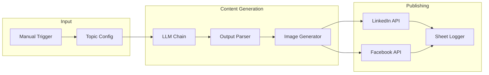
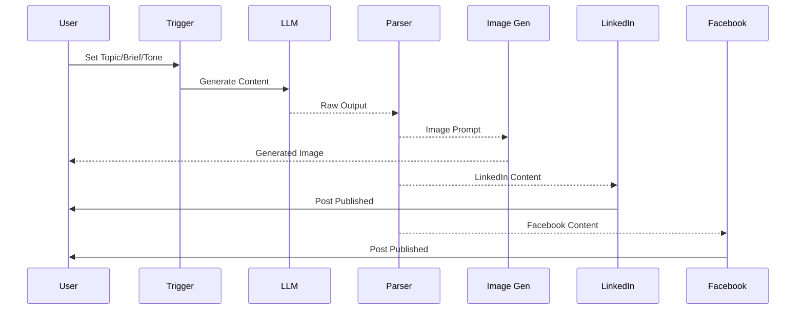
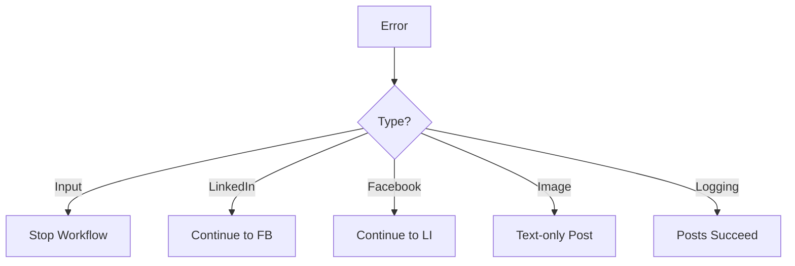

# AI Content Generation - Architecture

## System Overview

Multi-platform social media automation using AI for content creation, image generation, and publishing.

---

## Component Architecture



---

## Data Flow



---

## Content Structure

### Input

```json
{
  "Topic": "Personal Finance",
  "Brief": "Advice on investing...",
  "Tone": "Professional"
}
```

### Output (Structured)

```json
{
  "cities": [
    "Instagram Caption...",
    "LinkedIn Caption...",
    "Facebook Caption...",
    "Hashtags...",
    "CTA...",
    "Image Prompt..."
  ]
}
```

---

## Image Generation

**Service**: Pollinations.ai (Free)

```
URL: https://image.pollinations.ai/prompt/{encoded_prompt}
Method: GET
Output: PNG image
```

---

## LinkedIn Integration

- **Endpoint**: n8n LinkedIn node
- **Content**: Caption + Hashtags
- **Media**: Generated image

---

## Facebook Integration

- **Endpoint**: Graph API v22.0
- **Method**: POST with multipart/form-data
- **Content**: Caption + Hashtags + Image URL

---

## Configuration

### Required Environment Variables

```env
SHEET_OUTPUT_LOG_ID=
FACEBOOK_PAGE_ID=
FACEBOOK_ACCESS_TOKEN=
LINKEDIN_USER_ID=
```

---

## Security Considerations

1. **API Keys**: All stored in n8n credentials
2. **Access Tokens**: Should be short-lived and rotated
3. **Sheet Permissions**: Read/write for logging only
4. **Webhook Security**: Unique IDs for all triggers

---

## Error Handling


